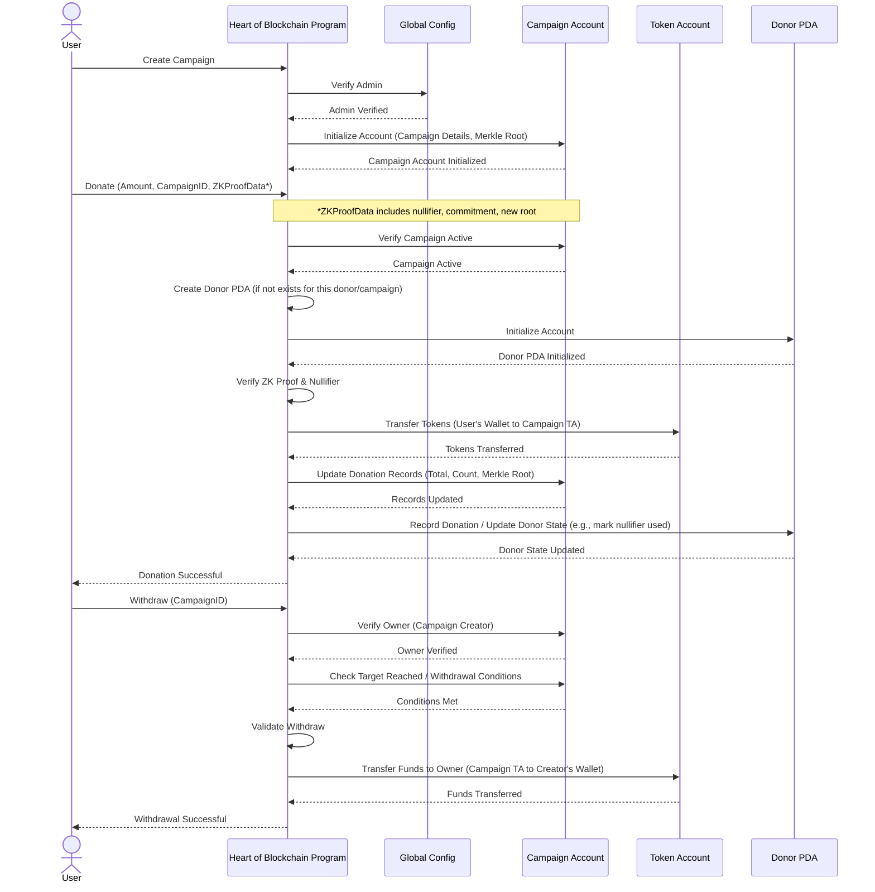

# Heart of Blockchain

A high-performance blockchain donation platform leveraging Solana and Light Protocol's zero-knowledge compression for scalable, private, and efficient on-chain donations.

## Project Overview

Heart of Blockchain is a next-generation donation platform that combines the transparency of blockchain with the privacy and scalability benefits of zero-knowledge proofs. Using Solana's high-performance blockchain and Light Protocol's ZK compression, the platform enables:

- **Scalable Donations**: Process thousands of donations with minimal on-chain storage costs
- **Privacy-Preserving**: Allow donors to maintain privacy while still contributing to campaigns
- **Transparent Accounting**: Maintain verifiable donation records without compromising user privacy
- **High Performance**: Support high-volume donation campaigns with minimal fees and latency

## Technical Architecture

The project architecture consists of four main components:

### 1. On-Chain Program (Solana Smart Contract)

The Solana program is the backbone of the platform, handling campaign management and donation processing:

- **Campaign State Management**: Stores campaign details and compressed state roots
- **Merkle Tree Integration**: Maintains Merkle roots for compressed donation data
- **Cross-Program Invocation (CPI)**: Interacts with Light Protocol for ZK operations
- **Proof Verification**: Validates ZK proofs for donation integrity

### 2. Light Protocol Integration

ZK compression is achieved through integration with Light Protocol:

- **Account Compression**: Reduces on-chain storage costs dramatically
- **Merkle Tree Management**: Efficiently stores and updates donation records
- **Proof Generation & Verification**: Enables privacy-preserving donation verification
- **State Synchronization**: Keeps compressed state in sync with on-chain data

### 3. Client SDK

The client SDK simplifies interaction with the platform:

- **LightProtocolService**: Manages connection and basic operations with Light Protocol
- **MerkleProofService**: Handles state fetching and proof generation/verification
- **TransactionService**: Builds and sends transactions with proofs to the blockchain
- **Caching & Error Handling**: Ensures robust and efficient client operations

### 4. Frontend Components

The user interface provides a seamless experience:

- **Campaign Management**: Interface for creating and managing donation campaigns
- **Donation Processing**: Streamlined donation workflow with ZK proof generation
- **Donation History**: Compressed data query and visualization
- **Authentication & Security**: Secure user access and wallet integration

## Platform Interaction Flow

The following diagram illustrates the core interaction sequences within the Heart of Blockchain platform:



## Implementation Details

### Merkle Tree Compression Schema

Donations are compressed into a Merkle tree with the following leaf structure:

```
DonationLeaf {
    donor: PublicKey,     // Donor's public key (or hash for privacy)
    amount: u64,          // Donation amount
    timestamp: i64,       // When the donation was made
    campaign_id: u64      // Associated campaign ID
}
```

The Merkle root is stored on-chain, while the full tree is maintained off-chain or in Solana logs, reducing storage costs by over 95%.

### ZK Proof Generation & Verification

The donation workflow involves the following steps:

1. **Proof Generation**: Client generates a zero-knowledge proof of valid donation
2. **Transaction Building**: Proof is packaged into a Solana transaction
3. **On-Chain Verification**: Program verifies the proof's validity
4. **State Update**: Merkle tree is updated with the new donation
5. **Receipt Issuance**: User receives confirmation of successful donation

### Campaign Management

Campaigns are managed through the following data structure:

```
Campaign {
    id: u64,
    name: String,
    description: String,
    target_amount: u64,
    creator: PublicKey,
    merkle_root: [u8; 32],  // Stores the root of the donation Merkle tree
    total_donations: u64,
    donation_count: u64,
    status: CampaignStatus
}
```

### Client SDK Architecture

The client SDK follows a service-oriented architecture:

1. **Core Services**:
   - `LightProtocolService`: Handles connection and authentication
   - `MerkleProofService`: Manages proof operations
   - `TransactionService`: Handles transaction lifecycle

2. **Helper Utilities**:
   - Caching mechanisms for performance
   - Retry logic for robust operations
   - Error handling and logging

3. **Integration Points**:
   - Wallet adapters for transaction signing
   - RPC interface for blockchain communication
   - Light Protocol SDK for ZK operations

## Development Progress

The project has been implemented in a systematic approach following these milestones:

1. ✅ **Research & Environment Setup**:
   - Investigated Light Protocol capabilities
   - Set up development environment
   - Configured compatible RPC endpoints

2. ✅ **On-Chain Program Implementation**:
   - Implemented Merkle root storage
   - Created Light Protocol CPI interfaces
   - Developed proof verification logic

3. ✅ **Compressed Donation Logic**:
   - Implemented donation instruction handlers
   - Created ZK proof verification
   - Developed Merkle tree update functionality

4. ✅ **Client SDK Integration**:
   - Built Light Protocol SDK integration
   - Implemented proof generation
   - Created transaction building services

5. ✅ **Data Query & Visualization**:
   - Implemented compressed data fetching
   - Created donation history components
   - Built data visualization elements

6. ✅ **Testing e2e-unity, static+dinamic audit & Documentation**:
   - Comprehensive test suite development
   - Security auditing
   - Mainnet deployment preparation

## Performance Benefits

The ZK compression approach offers significant benefits:

- **Storage Efficiency**: 95%+ reduction in on-chain storage costs
- **Transaction Throughput**: 5-10x improved TPS for donation processing
- **Cost Reduction**: Lower transaction fees and storage costs
- **Privacy Preservation**: Donors can maintain privacy while still contributing

## Security Considerations

The platform prioritizes security through:

- **Zero-Knowledge Proofs**: Ensures data validity without revealing sensitive information
- **Robust Verification**: On-chain verification of all proofs
- **Access Controls**: Strict permissions for campaign management
- **Audit Preparation**: Comprehensive testing and audit-ready code

## Future Extensions

Planned enhancements include:

- **Multi-chain Support**: Expand to other ZK-friendly blockchains
- **Advanced Analytics**: Provide insights while maintaining privacy
- **Recurring Donations**: Enable subscription-based contributions
- **Social Integration**: Social proof of donation without revealing amounts

## Documentation

For detailed technical documentation, please refer to the following resources:

- [Technical Design Document](./docs/technical-design.md) - Architecture and implementation decisions
- [Testing Strategy](./docs/testing-strategy.md) - Approach to testing the client SDK
- [ZK Implementation Guide](./docs/zkimplementation.md) - Details on the zero-knowledge implementation

Additional documentation can be found in the [docs directory](./docs).

## Getting Started

### Prerequisites

- Solana CLI tools
- Rust 1.65+
- Node.js 18+
- Light Protocol SDK

### Installation

```bash
# Clone the repository
git clone https://github.com/yourusername/heart-of-blockchain.git
cd heart-of-blockchain

# Install dependencies
npm install

# Build the Solana program
cd program
cargo build-bpf

# Run tests
cargo test-bpf
cd ../client
npm test
```

### Configuration

Create a `.env` file with the following values:

```
SOLANA_RPC_URL=<your_rpc_url>
LIGHT_PROTOCOL_RPC_URL=<light_protocol_rpc>
PROGRAM_ID=<deployed_program_id>
```

## Conclusion

Heart of Blockchain represents a significant advancement in blockchain donation platforms, leveraging cutting-edge zero-knowledge technology to provide superior privacy, efficiency, and scalability. By combining Solana's high-performance blockchain with Light Protocol's state compression, we've created a donation platform that can handle global-scale charitable giving while keeping costs low and protecting donor privacy.

The architecture described here provides a solid foundation for ongoing development and extension, with a focus on maintaining security, privacy, and performance as core principles. 