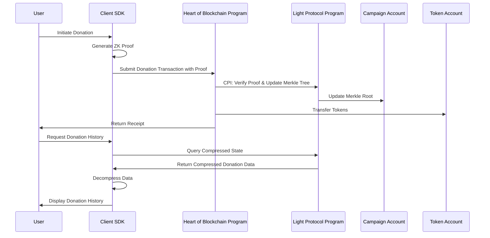

# Light Protocol ZK Compression Implementation

## Overview

This document details the implementation of Light Protocol's zero-knowledge (ZK) compression in the Heart of Blockchain project. The integration enables efficient storage of donation data while maintaining privacy and verifiability.

## Architecture

The Heart of Blockchain platform leverages Light Protocol's ZK compression through a multi-layered approach:



## Implementation Components

### 1. On-Chain Program (Solana Smart Contract)

#### Campaign State with Merkle Root

```rust
#[account]
pub struct Campaign {
    pub id: u64,
    pub creator: Pubkey,
    pub title: String,
    pub description: String,
    pub target_amount: u64,
    pub current_amount: u64,
    pub donation_count: u64,
    pub merkle_root: [u8; 32],  // Stores the Merkle root for compressed donations
    pub merkle_tree: Pubkey,    // Address of the Merkle tree account
    pub status: CampaignStatus,
}
```

#### Light Protocol CPI for Tree Creation

```rust
pub fn initialize_campaign(
    ctx: Context<InitializeCampaign>,
    id: u64,
    title: String,
    description: String,
    target_amount: u64,
) -> Result<()> {
    // Initialize campaign state
    let campaign = &mut ctx.accounts.campaign;
    campaign.id = id;
    campaign.creator = ctx.accounts.creator.key();
    campaign.title = title;
    campaign.description = description;
    campaign.target_amount = target_amount;
    campaign.current_amount = 0;
    campaign.donation_count = 0;
    campaign.merkle_root = [0; 32];  // Initialize with empty root
    campaign.merkle_tree = ctx.accounts.merkle_tree.key();
    campaign.status = CampaignStatus::Active;
    
    // Create Merkle tree via CPI to Light Protocol
    let cpi_program = ctx.accounts.light_protocol_program.to_account_info();
    let cpi_accounts = light_protocol::cpi::accounts::InitializeTree {
        authority: ctx.accounts.creator.to_account_info(),
        merkle_tree: ctx.accounts.merkle_tree.to_account_info(),
        system_program: ctx.accounts.system_program.to_account_info(),
    };
    
    let cpi_ctx = CpiContext::new(cpi_program, cpi_accounts);
    light_protocol::cpi::initialize_tree(
        cpi_ctx,
        MERKLE_TREE_HEIGHT,
        MERKLE_TREE_CAPACITY,
    )?;
    
    Ok(())
}
```

#### Compressed Donation Handling

```rust
pub fn donate_compressed(
    ctx: Context<DonateCompressed>,
    amount: u64,
    proof_data: Vec<u8>,
) -> Result<()> {
    // Verify proof via Light Protocol CPI
    let cpi_program = ctx.accounts.light_protocol_program.to_account_info();
    let cpi_accounts = light_protocol::cpi::accounts::VerifyProof {
        verifier: ctx.accounts.verifier.to_account_info(),
        merkle_tree: ctx.accounts.merkle_tree.to_account_info(),
    };
    
    let cpi_ctx = CpiContext::new(cpi_program, cpi_accounts);
    light_protocol::cpi::verify_proof(cpi_ctx, proof_data.clone())?;
    
    // Extract donation data from proof
    let donation_data = extract_donation_from_proof(&proof_data)?;
    
    // Update campaign state
    let campaign = &mut ctx.accounts.campaign;
    campaign.current_amount = campaign.current_amount.checked_add(amount)
        .ok_or(ProgramError::ArithmeticOverflow)?;
    campaign.donation_count = campaign.donation_count.checked_add(1)
        .ok_or(ProgramError::ArithmeticOverflow)?;
    
    // Update Merkle tree via CPI
    let cpi_program = ctx.accounts.light_protocol_program.to_account_info();
    let cpi_accounts = light_protocol::cpi::accounts::AppendLeaf {
        authority: ctx.accounts.donor.to_account_info(),
        merkle_tree: ctx.accounts.merkle_tree.to_account_info(),
    };
    
    let cpi_ctx = CpiContext::new(cpi_program, cpi_accounts);
    let new_root = light_protocol::cpi::append_leaf(cpi_ctx, donation_data.to_leaf_hash())?;
    
    // Update campaign with new Merkle root
    campaign.merkle_root = new_root;
    
    // Emit donation event
    emit!(DonationEvent {
        campaign_id: campaign.id,
        amount,
        donor: ctx.accounts.donor.key(),
        timestamp: Clock::get()?.unix_timestamp,
    });
    
    Ok(())
}
```

### 2. Client SDK Implementation

#### LightProtocolService

Primary service for interacting with Light Protocol:

```typescript
export class LightProtocolService {
  private rpc: RpcConnection;
  private connection: Connection;
  private program: Program | null = null;
  
  constructor(config: LightProtocolConfig = {}) {
    // Initialize connection to Solana and Light Protocol
    this.config = { ...DEFAULT_CONFIG, ...config };
    this.connection = new Connection(this.config.rpcUrl, this.config.commitment);
    this.rpc = createRpc(this.config.rpcUrl);
  }
  
  async initializeProgram(wallet: Wallet): Promise<Program> {
    // Load program from IDL and initialize
    const provider = new AnchorProvider(this.connection, wallet, {
      commitment: this.config.commitment
    });
    
    const idlPath = path.resolve(this.config.idlPath);
    const idl = JSON.parse(fs.readFileSync(idlPath, 'utf8'));
    
    this.program = new Program(idl, this.config.programId, provider);
    return this.program;
  }
  
  // Additional utility methods
}
```

#### MerkleProofService

Manages Merkle state and proof operations:

```typescript
export class MerkleProofService {
  private lightService: LightProtocolService;
  private stateCache: Map<string, any> = new Map();
  private proofCache: Map<string, MerkleProof> = new Map();
  
  constructor(
    lightService: LightProtocolService,
    options: MerkleProofOptions = {}
  ) {
    this.lightService = lightService;
    this.options = { ...DEFAULT_OPTIONS, ...options };
  }
  
  async fetchMerkleState(treeId: string, forceRefresh = false): Promise<any> {
    // Implementation with caching and retry logic
    const cacheKey = `state:${treeId}`;
    
    if (this.options.useCache && !forceRefresh && this.stateCache.has(cacheKey)) {
      return this.stateCache.get(cacheKey);
    }
    
    let retries = 0;
    
    while (retries < this.options.maxRetries) {
      try {
        const state = await this.lightService.getRpc().getCompressedState(treeId);
        
        if (this.options.useCache) {
          this.stateCache.set(cacheKey, state);
        }
        
        return state;
      } catch (error) {
        retries++;
        await new Promise(resolve => setTimeout(resolve, 1000));
      }
    }
    
    throw new Error(`Failed to fetch Merkle state after ${this.options.maxRetries} attempts`);
  }
  
  async generateProof(
    treeId: string,
    leafIndex: number,
    leafData: string,
    options: { forceRefresh?: boolean } = {}
  ): Promise<MerkleProof> {
    // Implementation with caching
    const cacheKey = `proof:${treeId}:${leafIndex}:${leafData}`;
    
    if (this.options.useCache && !options.forceRefresh && this.proofCache.has(cacheKey)) {
      return this.proofCache.get(cacheKey)!;
    }
    
    const state = await this.fetchMerkleState(treeId, options.forceRefresh);
    const proof = await this.lightService.getRpc().generateProof(state, leafIndex, leafData);
    
    if (this.options.useCache) {
      this.proofCache.set(cacheKey, proof);
    }
    
    return proof;
  }
  
  // Additional methods for proof verification and cache management
}
```

#### TransactionService

Builds and sends transactions with proofs:

```typescript
export class TransactionService {
  private lightService: LightProtocolService;
  private merkleService: MerkleProofService;
  private pendingTransactions: Map<string, TransactionStatus> = new Map();
  
  constructor(
    lightService: LightProtocolService,
    merkleService?: MerkleProofService
  ) {
    this.lightService = lightService;
    this.merkleService = merkleService || new MerkleProofService(lightService);
  }
  
  async buildTransactionWithProof(
    proof: MerkleProof,
    recipient: PublicKey,
    amount: number
  ): Promise<Transaction> {
    const transaction = new Transaction();
    const instructions = await this.createProofInstructions(proof, recipient, amount);
    transaction.add(...instructions);
    return transaction;
  }
  
  async sendTransaction(
    transaction: Transaction,
    signers: Signer[],
    options: TransactionOptions = {}
  ): Promise<TransactionResult> {
    const connection = this.lightService.getConnection();
    const defaultOptions = {
      confirmOptions: { commitment: 'confirmed' as Commitment },
      skipPreflight: false,
      maxRetries: 3
    };
    
    const mergedOptions = { ...defaultOptions, ...options };
    
    let currentRetry = 0;
    
    while (currentRetry <= mergedOptions.maxRetries) {
      try {
        const signature = await sendAndConfirmTransaction(
          connection,
          transaction,
          signers,
          mergedOptions.confirmOptions
        );
        
        this.pendingTransactions.set(signature, TransactionStatus.CONFIRMED);
        
        return {
          signature,
          status: TransactionStatus.CONFIRMED
        };
      } catch (error) {
        currentRetry++;
        
        if (currentRetry <= mergedOptions.maxRetries) {
          await new Promise(resolve => setTimeout(resolve, 1000 * currentRetry));
        }
      }
    }
    
    return {
      signature: 'failed',
      status: TransactionStatus.FAILED,
      error: new Error('Transaction failed after multiple retries')
    };
  }
  
  // Additional methods for transaction status tracking and utilities
}
```

## Donation Data Structure

Donations are compressed into a Merkle tree with the following leaf structure:

```typescript
interface DonationLeaf {
  donor: PublicKey;     // Donor public key or commitment
  amount: number;       // Donation amount
  timestamp: number;    // Unix timestamp
  campaignId: number;   // Campaign identifier
}

// Conversion to bytes for Merkle leaf
function donationToBytes(donation: DonationLeaf): Uint8Array {
  const buffer = new Uint8Array(80); // 32 + 8 + 8 + 4 + padding
  
  buffer.set(donation.donor.toBytes(), 0);
  new BigNumber(donation.amount).toArrayLike(Uint8Array, 'le', 8).forEach((b, i) => {
    buffer[32 + i] = b;
  });
  new BigNumber(donation.timestamp).toArrayLike(Uint8Array, 'le', 8).forEach((b, i) => {
    buffer[40 + i] = b;
  });
  new BigNumber(donation.campaignId).toArrayLike(Uint8Array, 'le', 4).forEach((b, i) => {
    buffer[48 + i] = b;
  });
  
  return buffer;
}
```

## Performance Optimizations

1. **Caching Strategy**:
   - Merkle state caching with configurable TTL
   - Proof caching for frequently accessed data
   - Conditional fetch with force refresh option

2. **Batch Processing**:
   - Support for multiple leaf operations when possible
   - Optimized transaction building for multiple operations

3. **Error Handling & Retry Logic**:
   - Configurable retry policies with exponential backoff
   - Detailed error categorization and recovery strategies

## Security Considerations

1. **Proof Verification**:
   - All proofs are verified on-chain before state updates
   - Double verification in client and on-chain for critical operations

2. **Access Control**:
   - Strict permission checks for campaign management
   - Only authorized users can update trees via CPI

3. **Merkle Tree Integrity**:
   - Root consistency checked on every update
   - Historical roots maintained for auditability

## Future Enhancements

1. **Advanced Privacy Features**:
   - Zero-knowledge donations with hidden amounts
   - Stealth addressing for enhanced donor privacy

2. **Performance Improvements**:
   - Parallel proof generation for high-volume scenarios
   - Optimized serialization/deserialization

3. **Cross-Chain Support**:
   - Abstraction layer for multiple ZK-enabled blockchains
   - Bridge support for multi-chain donations

## Reference Implementation

For full implementation details, refer to:
- Client SDK code in `client/src/services/`
- On-chain program code in `programs/zk_donations/src/`
- Integration tests in `tests/` 