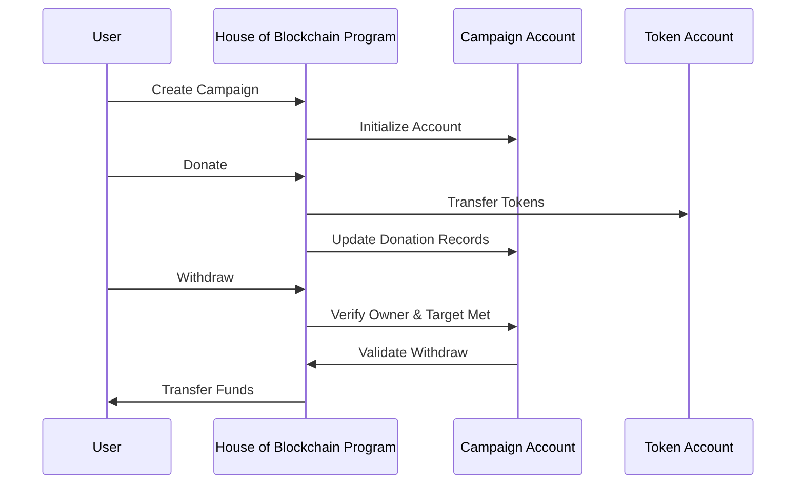
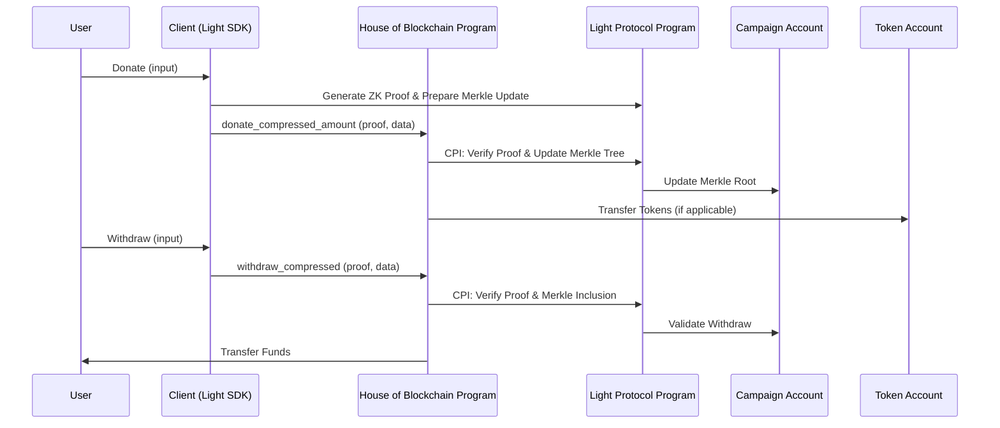

# Light Protocol ZK Compression Integration Plan

## Objective
Integrate the Light Protocol SDK (ZK Compression) into the Solana donation campaign system to reduce on-chain storage costs, scale the system, and maintain L1 security and composability.

---

## Previous Stack (Donation Flow)



---

## New Stack with Light Protocol ZK Compression



---

## Implementation Phases

### 1. Research and Environment Setup
- **(Done)** Review official Light Protocol and ZK Compression documentation.
  - **Key Findings:** State stored on ledger via Merkle Tree account managed by Light's Account Compression Program (`compr6...`). On-chain program needs CPIs to create tree (`init_campaign`) and append leaves (`donate_compressed`). Append CPI requires off-chain generated ZK validity proof via SDK. SDK uses `getAsset`/`getAssetProof` RPC methods. ZK-compatible RPC (e.g., Helius) mandatory. Cost shifts from rent to tx fees.
- **(Done)** Install and configure the Light Protocol SDK and CLI.
  - **Steps:**
    1. Clone the official Light Protocol repository into `external/light-protocol` (already done).
    2. Install dependencies and setup the environment:
       ```bash
       cd external/light-protocol
       ./scripts/install.sh
       ```
       - For full production keys (optional):
         ```bash
         ./scripts/install.sh --full-keys
         ```
    3. Activate the development environment:
       ```bash
       ./scripts/devenv.sh
       ```
    4. (Optional) Build the project:
       ```bash
       ./scripts/build.sh
       ```
    5. (Optional) Run tests:
       ```bash
       ./scripts/test.sh
       ```
  - **Notes:**
    - All dependencies will be installed in `.local` inside the repo, so they won't interfere with global installations.
    - You can use `pnpm`, `cargo`, `solana`, etc., from within the activated environment.
    - For SDK usage in your project, reference the code in `external/light-protocol/js/`.
- **(Done)** Ensure access to a compatible RPC (e.g., Helius) and a working local/testnet environment.
  - **RPC Provider:** Helius (Devnet)
  - **Endpoint:**
    ```
    https://devnet.helius-rpc.com/?api-key=0671b636-b70b-4071-9750-ab6f88409879
    ```
  - **How to use:**
    - Set this endpoint in your environment variables or configuration files for both the Light Protocol SDK and CLI.
    - Example for SDK (TypeScript):
      ```typescript
      const connection = new Connection('https://devnet.helius-rpc.com/?api-key=0671b636-b70b-4071-9750-ab6f88409879');
      ```
    - Example for CLI (if required):
      ```bash
      export HELIUS_RPC_URL='https://devnet.helius-rpc.com/?api-key=0671b636-b70b-4071-9750-ab6f88409879'
      ```
  - **Test Environment:**
    - All development and integration tests will be run against Solana Devnet using this endpoint.

### 2. On-Chain Program Modification
- **(Next)** Implement CPI to Light Protocol for tree creation in `initialize_campaign`.
- **(Pending)** Add Merkle root field to campaign state.
- **(Pending)** Adapt instructions to accept ZK proofs and update compressed state.

### 3. Compressed Donation Instruction
- Create or modify the donation instruction to accept ZK proofs and update the Merkle tree via Light Protocol.
- Validate and update the root in the campaign account.

### 4. Client SDK Integration
- Use the Light Protocol SDK to generate ZK proofs and build transactions.
- Configure the client to use a compatible RPC.
- Send transactions with proofs and required accounts.

### 5. Compressed Data Query and Display
- Use Light Protocol RPC methods to query compressed state and display donation history.

### 6. Testing, Audit, and Deployment
- Unit, integration, and end-to-end tests.
- Security audit and mainnet deployment.

---

## Current Status
- [X] Phase 1: Research and environment setup - Done.
- [X] Phase 2: On-chain program modification - In Progress.
  - [ ] Subtask 2.1: Implement `initialize_campaign` CPI - In Progress (Next Step).
  - [ ] ... (Other subtasks for Phase 2)
- [ ] Phase 3: Compressed donation instruction - Pending.
- [ ] Phase 4: Client SDK integration - Pending.
- [ ] Phase 5: Compressed data query - Pending.
- [ ] Phase 6: Testing and deployment - Pending.

---

This document will be updated at every major project milestone to reflect the real status and technical decisions taken.

---

## On-Chain Program: zk_donations (Anchor)

### Initial Structure
- **Location:** `programs/zk_donations/`
- **Framework:** Anchor (latest stable)
- **Language:** Rust
- **Test Suite:** JavaScript (recommended: upgrade Node.js to >= 20.18.0)

### Security Rationale
- All instructions will use strict account validation (Anchor constraints).
- Only authorized signers can initialize or modify campaigns.
- Checked arithmetic and explicit error handling will be enforced.
- Minimal account mutability and CPI scope.
- Anchor's best practices for seeds, bump, and PDA derivation will be followed.
- All public functions and state will be documented with Rust doc comments.

### First Secure Instruction: initialize_campaign
- **Purpose:**
  - Create a new campaign account (PDA) for the user.
  - Create a new Merkle tree (State Merkle Tree Account) via CPI to Light Protocol's account compression program.
  - Store the Merkle tree account address in the campaign state.
- **Accounts:**
  - `[signer]` User (initializer)
  - `[writable]` Campaign (PDA, derived from user and campaign id)
  - `[writable]` State Merkle Tree Account (created via CPI)
  - `system_program`, `rent`, and Light Protocol's account compression program
- **Arguments:**
  - Campaign id (u64), title (String), description (String), Merkle tree params (depth, buffer size)
- **Security:**
  - Only the initializer can create their campaign.
  - All CPIs are checked for success; errors are bubbled up.
  - Merkle tree params are validated to prevent DoS or excessive resource use.
- **References:**
  - [Anchor CPI docs](https://book.anchor-lang.com/chapter_8/)
  - [Light Protocol account compression CPI example](https://github.com/Lightprotocol/light-protocol)

### Node.js Version Recommendation
- For Anchor JS tests and Solana compatibility, use Node.js >= 20.18.0.
- You can upgrade with:
  ```bash
  nvm install 20.18.0
  nvm use 20.18.0
  ```

---

## Next Coding Step
- Implement the `initialize_campaign` instruction in Rust, following the above security and integration guidelines.
- Add Rust doc comments and Anchor constraints for all accounts and arguments.
- Prepare a JavaScript test for campaign initialization. 